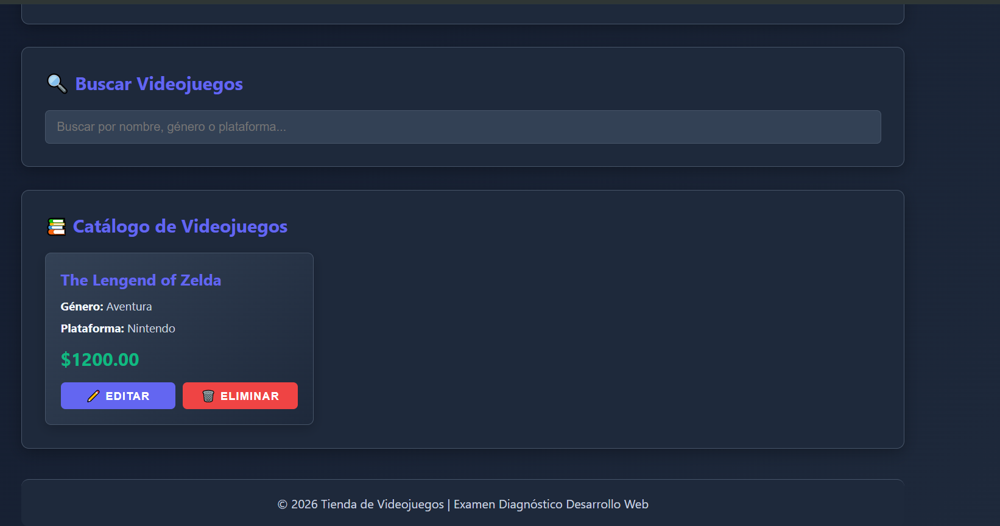
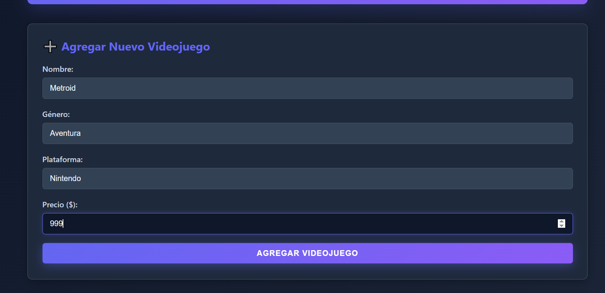
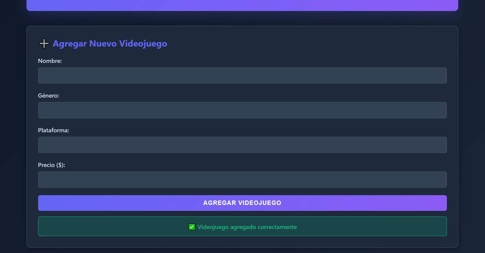
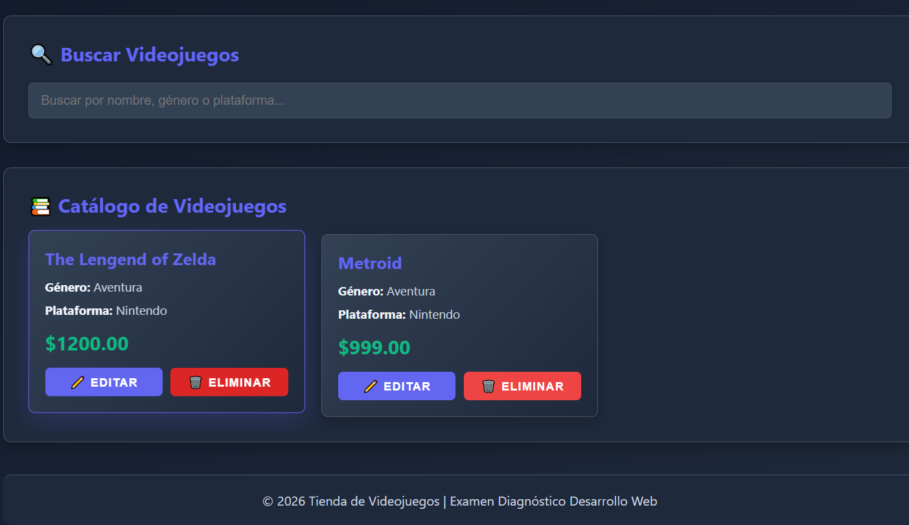
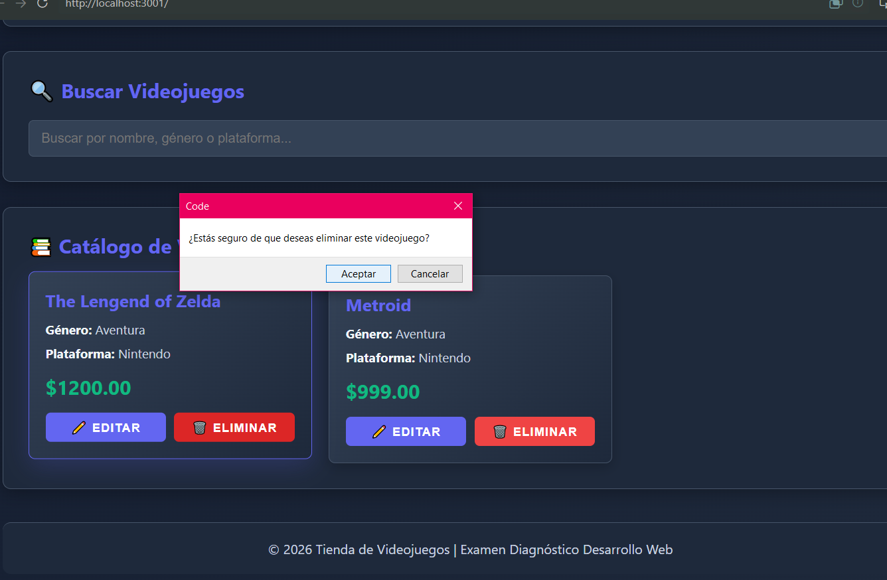
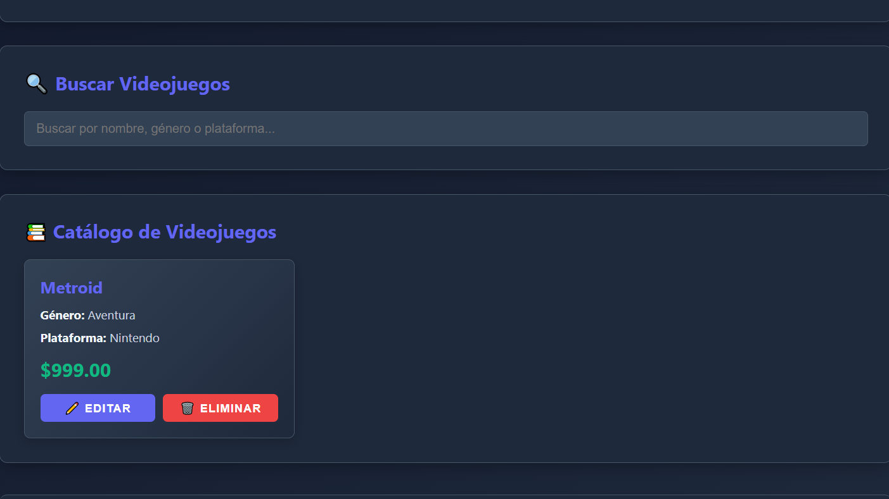

# Tienda de Videojuegos

Catálogo digital de venta de videojuegos construido con Django y Django REST Framework.

## Descripción

Este proyecto es una API REST para gestionar una tienda de videojuegos. Permite realizar operaciones CRUD (Crear, Leer, Actualizar, Eliminar) sobre un catálogo de videojuegos con información como nombre, género, plataforma, precio y foto.

## Tecnologías

- **Backend**: Django 3.x+
- **API**: Django REST Framework
- **Base de Datos**: SQLite3
- **Lenguaje**: Python 3.x

## Estructura del Proyecto

```
examenDiag-desarrolloWeb-jose/
├── manage.py                 # Gestor de Django
├── README.md                 # Este archivo
├── static/                   # Archivos estáticos
├── Tienda/                   # Configuración principal del proyecto
│   ├── settings.py          # Configuración de Django
│   ├── urls.py              # Rutas principales
│   ├── wsgi.py              # Configuración WSGI
│   └── asgi.py              # Configuración ASGI
└── videojuegos/             # Aplicación principal
    ├── models.py            # Modelos de datos
    ├── views.py             # Vistas y ViewSets
    ├── serializer.py        # Serializadores DRF
    ├── urls.py              # Rutas de la aplicación
    ├── admin.py             # Panel administrativo
    ├── apps.py              # Configuración de la app
    ├── tests.py             # Pruebas unitarias
    └── migrations/          # Migraciones de BD
```

## Funcionalidades

- **Agregar** nuevos videojuegos al catálogo
- **Consultar** disponibilidad y detalles de videojuegos
- **Editar** datos de videojuegos existentes
- **Eliminar** videojuegos del catálogo
- **API REST** completa con serialización JSON

## Requisitos Previos

- Python 3.x
- pip (gestor de paquetes de Python)
- Git (opcional)

## Instalación y Configuración

### 1. Clonar el repositorio (o descargar el proyecto)

```bash
git clone <url-del-repositorio>
cd examenDiag-desarrolloWeb-jose
```

### 2. Crear un entorno virtual (recomendado)

```bash
python -m venv venv
```

Activar el entorno virtual:
- **Windows**:
  ```bash
  venv\Scripts\activate
  ```
- **Linux/Mac**:
  ```bash
  source venv/bin/activate
  ```

### 3. Instalar dependencias

```bash
pip install django djangorestframework pillow
```

### 4. Realizar las migraciones

```bash
python manage.py migrate
```

### 5. Crear un superusuario (opcional, para el admin)

```bash
python manage.py createsuperuser
```

## Ejecución del Proyecto

Para iniciar el servidor de desarrollo:

```bash
python manage.py runserver
```

El servidor estará disponible en: `http://127.0.0.1:8000/`

## Endpoints de la API

### Base URL
```
http://localhost:8000/api/videojuegos/
```

### Operaciones Disponibles

| Método | Endpoint | Descripción |
|--------|----------|-------------|
| GET | `/api/videojuegos/` | Listar todos los videojuegos |
| POST | `/api/videojuegos/` | Crear un nuevo videojuego |
| GET | `/api/videojuegos/{id}/` | Obtener detalles de un videojuego |
| PUT | `/api/videojuegos/{id}/` | Actualizar un videojuego completo |
| PATCH | `/api/videojuegos/{id}/` | Actualizar parcialmente un videojuego |
| DELETE | `/api/videojuegos/{id}/` | Eliminar un videojuego |

## Modelo de Datos

### Videojuego

```python
{
    "id": 1,
    "nombre": "The Legend of Zelda",
    "genero": "Aventura",
    "plataforma": "Nintendo Switch",
    "precio": 59.99,
    "foto": "videojuegos/zelda.jpg"
}
```

**Campos**:
- `id` - Identificador único (auto-generado)
- `nombre` - Nombre del videojuego (máximo 100 caracteres)
- `genero` - Género del juego (máximo 50 caracteres)
- `plataforma` - Plataforma de juego (máximo 50 caracteres)
- `precio` - Precio del videojuego (hasta 10 dígitos, 2 decimales)
- `foto` - Imagen del videojuego (opcional)

## Ejemplo de Uso

### Listar todos los videojuegos
```bash
curl http://localhost:8000/api/videojuegos/
```

### Crear un nuevo videojuego
```bash
curl -X POST http://localhost:8000/api/videojuegos/ \
  -H "Content-Type: application/json" \
  -d '{
    "nombre": "Elden Ring",
    "genero": "RPG",
    "plataforma": "PC",
    "precio": 59.99
  }'
```

### Actualizar un videojuego
```bash
curl -X PUT http://localhost:8000/api/videojuegos/1/ \
  -H "Content-Type: application/json" \
  -d '{
    "nombre": "Elden Ring",
    "genero": "Action RPG",
    "plataforma": "Multi-plataforma",
    "precio": 49.99
  }'
```

### Eliminar un videojuego
```bash
curl -X DELETE http://localhost:8000/api/videojuegos/1/
```

## 🔐 Panel Administrativo

Accede al panel administrativo de Django en:
```
http://localhost:8000/admin/
```

Usa las credenciales del superusuario creado anteriormente.

---

# 🎨 Frontend con Node.js

También incluye un frontend moderno con Express.js y JavaScript para consumir la API de manera más visual.

## ✨ Características del Frontend

- 🎮 Interfaz moderna con tema oscuro
- 📱 Diseño responsive para móviles y desktop
- 🔍 Búsqueda en tiempo real de videojuegos
- ➕ Formulario para agregar nuevos videojuegos
- ✏️ Modal interactivo para editar
- 🗑️ Eliminación con confirmación
- ✨ Animaciones suaves y transiciones

## 📦 Requisitos del Frontend

- Node.js 14+
- npm (incluido con Node.js)
- Servidor Django ejecutándose

## 🚀 Instalación del Frontend

### 1. Navegar a la carpeta del frontend

```bash
cd frontend
```

### 2. Instalar dependencias

```bash
npm install
```

### 3. Ejecutar el servidor

```bash
npm start
```

El frontend estará disponible en: **http://localhost:3000/**

## 🎯 Usar en Modo Desarrollo

Para desarrollo con auto-reinicio de servidor:

```bash
npm run dev
```

Requiere tener `nodemon` instalado (se instala automáticamente con `npm install`).

## 📁 Estructura del Frontend

```
frontend/
├── server.js           # Servidor Express con proxy API
├── package.json        # Dependencias
├── README.md          # Documentación específica del frontend
├── .gitignore         # Archivos a ignorar en git
└── public/            # Archivos estáticos
    ├── index.html     # Interfaz HTML
    ├── styles.css     # Estilos CSS (tema oscuro)
    └── script.js      # Lógica JavaScript para interactuar con la API
```

## 🔧 Dependencias del Frontend

```json
{
  "express": "^4.18.2",
  "axios": "^1.4.0",
  "cors": "^2.8.5"
}
```

## 🌐 Ejecución Completa del Proyecto

Para usar la aplicación completa, debes ejecutar ambos servidores:

### Terminal 1 - Backend Django

```bash
python manage.py runserver
```

Disponible en: `http://localhost:8000/`

### Terminal 2 - Frontend Node.js

```bash
cd frontend
npm start
```

Disponible en: `http://localhost:3000/`

## 📡 Flujo de Comunicación

```
Cliente (Navegador)
    ↓ (solicitud HTTP)
Frontend Node.js (http://localhost:3000/)
    ↓ (proxy API)
Backend Django (http://localhost:8000/api/videojuegos/)
    ↓ (respuesta JSON)
Base de Datos (SQLite3)
```

## 🎨 Interfaz del Frontend

- **Header**: Título y descripción del proyecto
- **Sección de Agregar**: Formulario para crear nuevos videojuegos
- **Sección de Búsqueda**: Campo para filtrar videojuegos
- **Catálogo**: Grid de tarjetas con todos los videojuegos
- **Tarjeta de Videojuego**: Muestra nombre, género, plataforma y precio
- **Acciones**: Botones para editar y eliminar
- **Modal de Edición**: Formulario para actualizar videojuegos
- **Footer**: Información del proyecto

## 🛠️ Solución de Problemas Comunes

### Error: "Cannot find module 'express'"

```bash
cd frontend
npm install
```

### Error: "ECONNREFUSED" al conectar

- Verifica que Django está ejecutándose en `http://localhost:8000/`
- Asegúrate de que el puerto 8000 de Django está disponible

### Error: "Port 3000 already in use"

```bash
# Cambiar puerto en Windows
set PORT=3001 && npm start

# O matar el proceso que usa el puerto
netstat -ano | findstr :3000
taskkill /PID <PID> /F
```

## 📚 Recursos Adicionales

### Backend
- [Documentación de Django](https://docs.djangoproject.com/)
- [Documentación de Django REST Framework](https://www.django-rest-framework.org/)
- [SQLite3 Documentación](https://www.sqlite.org/docs.html)

### Frontend
- [Documentación de Express.js](https://expressjs.com/)
- [Documentación de Axios](https://axios-http.com/)
- [Documentación de Node.js](https://nodejs.org/docs/)

## 📖 Documentación Específica

Para más información sobre el frontend, consulta [frontend/README.md](frontend/README.md)

## 👨‍💻 Autor

Proyecto desarrollado como examen diagnóstico de desarrollo web.

**Componentes:**
- Backend: Django + Django REST Framework
- Frontend: Express.js + HTML5 + CSS3 + JavaScript Vanilla

## 📄 Licencia

Este proyecto está disponible bajo la licencia MIT.

## Evidencias
- 
- 
- 
- 
- 
- 

## Uso de IA
- **Redacción de README**
- **Asistencia en la construcción del frontend**
- **Asistencia en análisis de errores durante la construcción del frontend**
- **Asistencia en el diseño del frontend**
- **Recordatorio de comandos específicos**